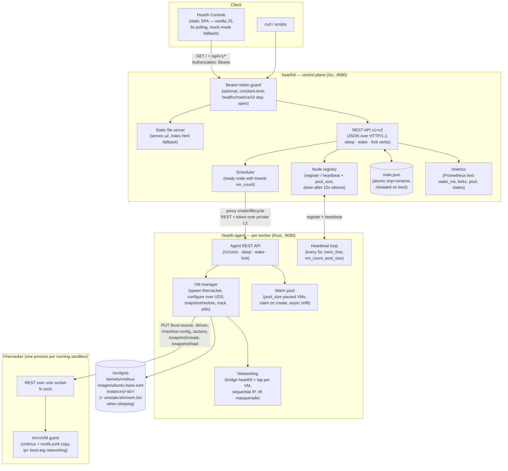
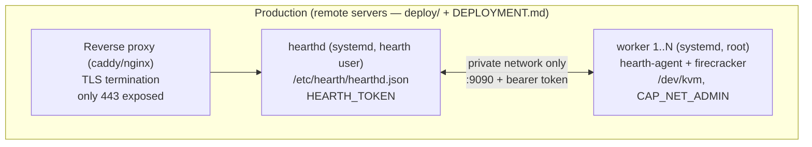
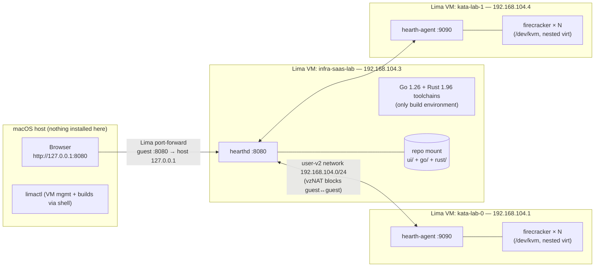
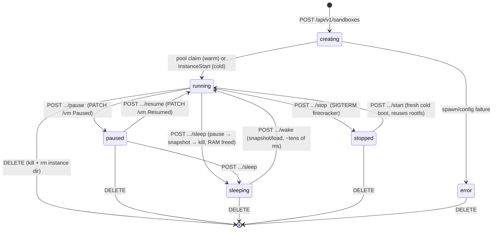
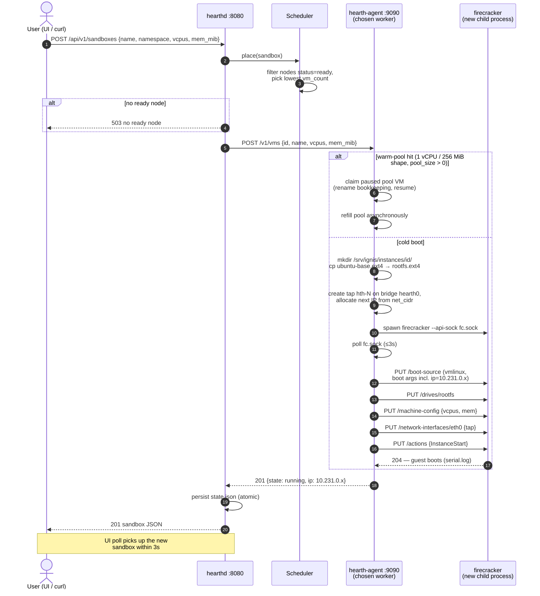
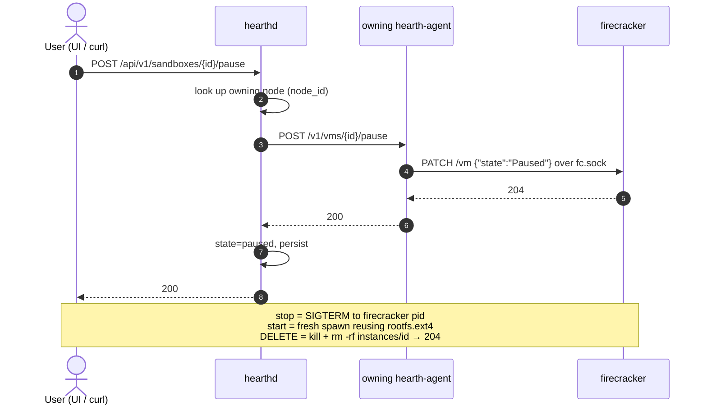
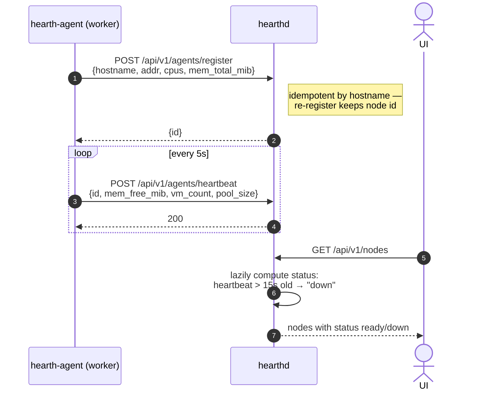
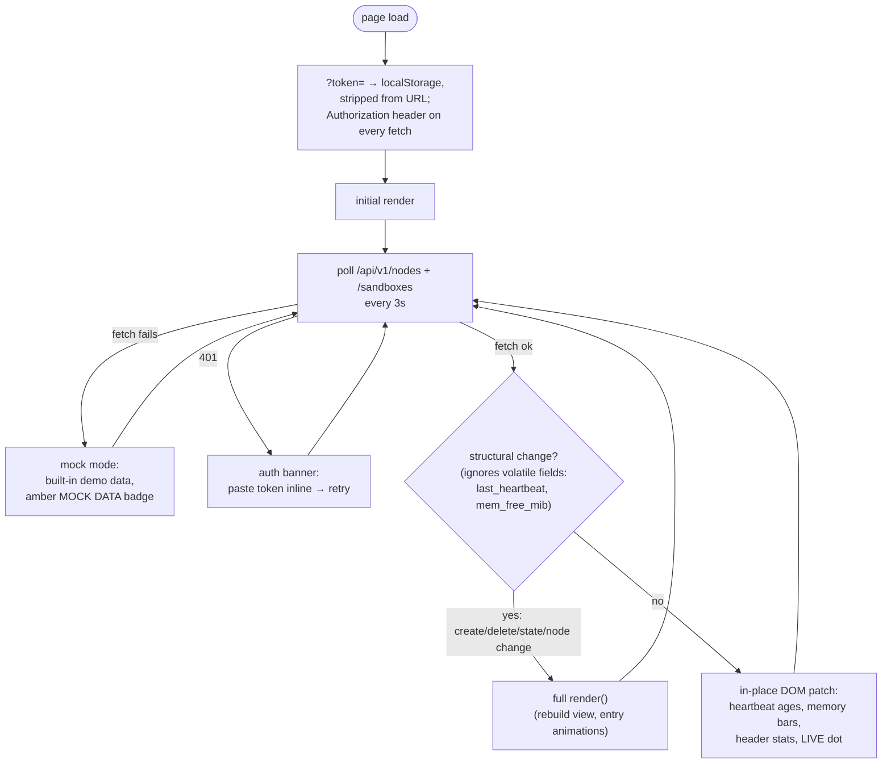
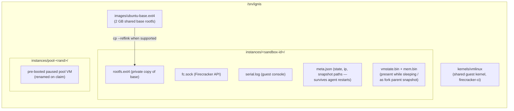

# Hearth — Architecture

Hearth is a self-hosted infrastructure SaaS that manages **Firecracker microVMs ("sandboxes") for AI workloads**.
The backend is two static binaries — `hearthd` (control plane, **Go**) and `hearth-agent` (node agent,
**Rust**) — with no Kubernetes on the control path (languages per
[ADR-0003](adr/ADR-0003-go-rust-port.md); the wire and on-disk formats are unchanged from the Zig v2
implementation and enforced by `test/conformance/`). This document reflects **v2 as implemented, verified
(17/17 end-to-end checks), and running** in the Lima lab: snapshot-based sleep/wake (~70 ms measured),
fork, warm pools, guest networking, bearer-token auth, and config-driven deployment — the same
static binaries (aarch64 + x86_64) run on the local lab and on remote production servers,
differing only by configuration. Remaining v3 items are listed in §9.

Related docs: [PLAN.md](PLAN.md) (adopted plan), [API-V2.md](API-V2.md) (v2 API/config contract),
[DEPLOYMENT.md](DEPLOYMENT.md) (production install + builds), [ADR-0000](adr/ADR-0000-original-hearth-plan.md)
(original baseline), [ADR-0001](adr/ADR-0001-zig-backend.md) (superseded),
[ADR-0002](adr/ADR-0002-no-kubernetes-control-plane.md), [ADR-0003](adr/ADR-0003-go-rust-port.md)
(Go+Rust port and migration record).

---

## 1. System overview

**Hot-path principle (kept from the baseline plan):** sandboxes are *not* k8s pods. The agent drives
Firecracker directly; the control plane only does placement and proxying. v2 delivers this: the warm
pool is claimed and refilled entirely on the agent, and wake is one `/snapshot/load` away — no
control-plane round trip on the latency-critical path.

---

## 2. Deployment topology

The same binaries serve two topologies, differing **only by configuration**
(precedence: flags > `HEARTH_*` env > `--config` JSON > defaults — see [API-V2.md](API-V2.md) §6):

### Lima lab (development)

> **Networking gotcha:** Apple's vzNAT (`lima0`, 192.168.64.x) gives **no guest-to-guest connectivity**
> (verified: 100% loss). All inter-VM traffic uses Lima's `user-v2` network. Guests inside microVMs
> get IPs from the per-node `net_cidr` (default `10.231.0.0/24`) via the `hearth0` bridge — verified
> by host→guest ping; `--net off` restores IP-less operation.

---

## 3. Sandbox state machine

**v2 wake path (verified on the lab):** `sleep` = pause → `PUT /snapshot/create` (vmstate.bin +
mem.bin in the instance dir) → kill the Firecracker process (RAM freed). `wake` = fresh process →
`PUT /snapshot/load {resume_vm:true, network_overrides:[tap]}` → guest resumes mid-execution
(**measured wake_ms=73** on this lab). `fork` snapshots the parent (reusing snapshot files if
sleeping), copies rootfs + mem, restores the child with its own tap, sets `parent_id` — caveat:
the child inherits the parent's guest-internal IP until v3. `stopped` vs `sleeping`: cold boot
vs warm resume.

---

## 4. User flow — create a sandbox

On error at any agent step the sandbox is marked `error` and surfaced in the UI/API.

---

## 5. User flow — lifecycle operation (pause / resume / stop / delete)

---

## 5b. User flow — sleep, wake, fork (the v2 hot path)

```mermaid
sequenceDiagram
    autonumber
    actor U as User (UI / curl)
    participant H as hearthd
    participant A as owning hearth-agent
    participant F as firecracker

    rect rgb(35,35,45)
    Note over U,F: SLEEP — free the RAM, keep the moment
    U->>H: POST /api/v1/sandboxes/{id}/sleep
    H->>A: POST /v1/vms/{id}/sleep
    A->>F: PATCH /vm {"state":"Paused"}
    A->>F: PUT /snapshot/create<br/>{vmstate.bin + mem.bin → instance dir}
    A->>A: kill firecracker, reap<br/>(RAM freed, files remain)
    A-->>H: 200 → state=sleeping, persisted
    end

    rect rgb(30,40,35)
    Note over U,F: WAKE — measured 73 ms on this lab
    U->>H: POST /api/v1/sandboxes/{id}/wake
    H->>A: POST /v1/vms/{id}/wake
    A->>F: spawn fresh firecracker
    A->>F: PUT /snapshot/load {resume_vm:true,<br/>network_overrides:[tap]}
    F-->>A: guest resumes mid-execution<br/>(no boot, no init, no warmup)
    A-->>H: 200 {state: running, wake_ms}
    H-->>U: sandbox + wake_ms (UI toast)
    end

    rect rgb(40,35,30)
    Note over U,F: FORK — one parent, N children
    U->>H: POST /api/v1/sandboxes/{id}/fork {"name"}
    H->>A: POST /v1/vms/{id}/fork
    A->>A: ensure parent snapshot<br/>(reuse if sleeping — pause→snap→resume if running)
    A->>A: reflink/copy rootfs + mem.bin to child dir,<br/>create child tap
    A->>F: spawn + /snapshot/load (child tap override)
    A-->>H: 201 child {parent_id: parent}
    end
```

Snapshot hygiene caveats (documented, v3 work): forked children inherit the parent's
guest-internal IP, and restored guests should re-seed entropy / fix clocks before
multi-tenant production use. **Do not sleep a guest that is still booting**: a snapshot
taken ~1–2 s after boot captures a guest that panics/reboots on resume (wall-clock jump
mid-init) — the wake API reports `running` but the Firecracker process exits about a
second later. Found during the Go/Rust migration and present in every implementation;
`verify-v2.sh` now pings the guest after wake to keep this visible.

---

## 6. Node lifecycle — registration, heartbeat, failure detection

The scheduler reads `vm_count` from heartbeats, so placement freshness is bounded by the 5s
heartbeat interval (known wart: rapid back-to-back creates can land on one node). Registration
and heartbeats carry the bearer token when auth is enabled. Sleeping VMs survive agent restarts:
the agent reconciles instance dirs and `meta.json` on startup.

---

## 7. User flow — UI data loop (live vs mock, flicker-free updates)

This split is what fixed the visible flicker: heartbeats mutate every poll, so only genuinely
structural changes rebuild the DOM; volatile values are patched into existing elements.

---

## 8. Storage layout (per worker)

v3 replaces the full rootfs copy with **overlayfs**: shared read-only base + tiny per-VM upper layer
(the E2B/Modal image-dedup pattern), which also makes disk fork O(1) — today fork copies
`rootfs.ext4` and `mem.bin` (simple and safe; shared read-only memory mapping is the v3 optimization).

---

## 9. v2 status (shipped) and what remains for v3

Shipped in v2, then ported to Go (`hearthd`) and Rust (`hearth-agent`) under the frozen
API-V2 contract — all verified end-to-end on the lab (17/17 system checks +
`test/conformance/` contract suite, goldens recorded from the Zig reference;
migration record in [ADR-0003](adr/ADR-0003-go-rust-port.md)):

| Capability | v2 implementation |
|---|---|
| `sleep` / `wake` | snapshot/create → kill; snapshot/load resume — **wake_ms≈70 measured** (67–85 across both implementations) |
| `fork` | parent snapshot + rootfs/mem copy + own tap via `network_overrides`, `parent_id` set |
| Warm pool | `pool_size` paused VMs per agent; matching create claims one, async refill |
| Guest networking | bridge `hearth0` + per-VM tap + sequential IP (`net_cidr`) + nftables masquerade; `ip` populated; host→guest ping verified |
| Auth | optional bearer token (`HEARTH_TOKEN`/config/flag); 401 without; constant-time compare; UI `?token=` support |
| Production config | flags > env (`HEARTH_*`) > `--config` JSON > defaults; no hardcoded paths; static binaries for **aarch64 + x86_64**; systemd units + installer in `deploy/`, guide in `DEPLOYMENT.md` |

Remaining for v3:

| Capability | v3 mechanism |
|---|---|
| `branch` (fork a *running* VM without pausing perception) | diff snapshots + uffd shared-memory CoW (fork currently copies mem.bin) |
| Fork guest-IP uniqueness | re-IP child guests (vsock agent or DHCP) — today the child inherits the parent's IP |
| Cross-tenant network isolation | nftables drop between namespace IP sets |
| Root-disk dedup | overlayfs shared RO base (today: full rootfs copy per VM) |
| State store | JSON file → SQLite WAL → Postgres at scale-out |
| Reschedule across nodes | snapshot → ship → restore (needs node-decoupled storage) |
| OIDC / multi-user auth | token-exchange on top of the bearer layer |
| Pool-orphan reclaim | a paused pool FC orphaned by an agent restart is reconciled to `stopped` but its process is not reaped (1:1 with v2 behavior) |
| uffd lazy restore / CoW fork | in-process userfaultfd in the Rust agent (the reason the agent is Rust — rust-vmm territory) |
| Terraform provider | Go provider against the hearthd API (the reason the control plane is Go) |
