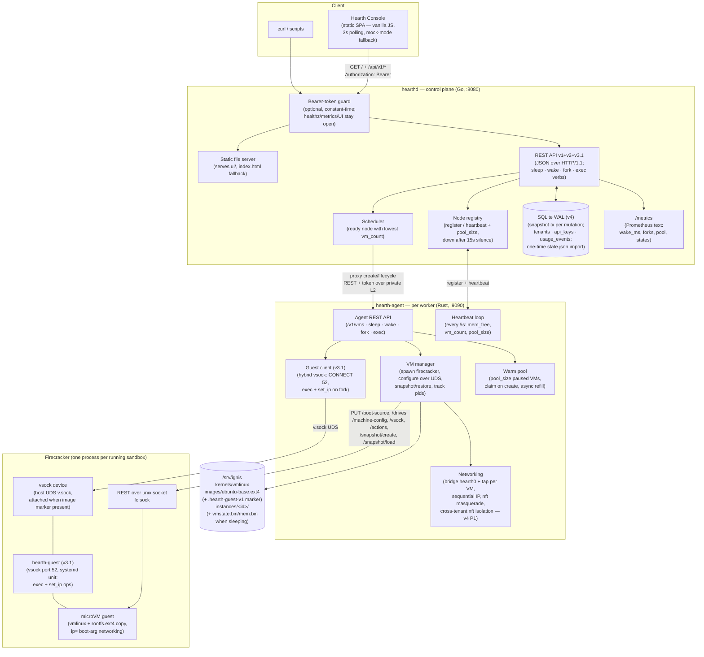
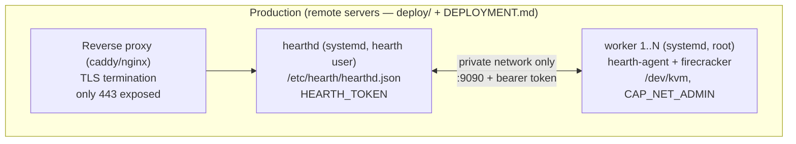
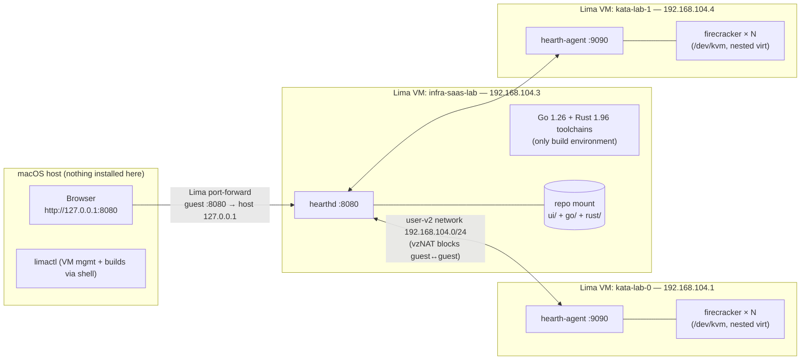
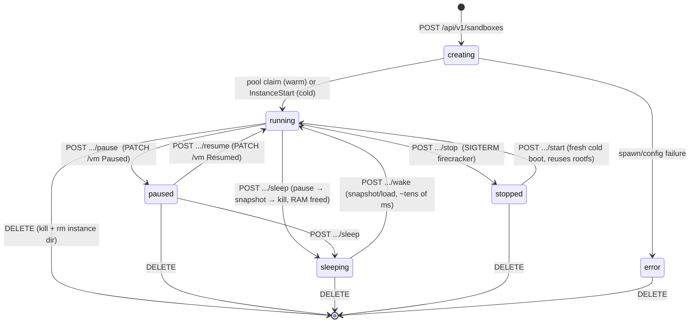
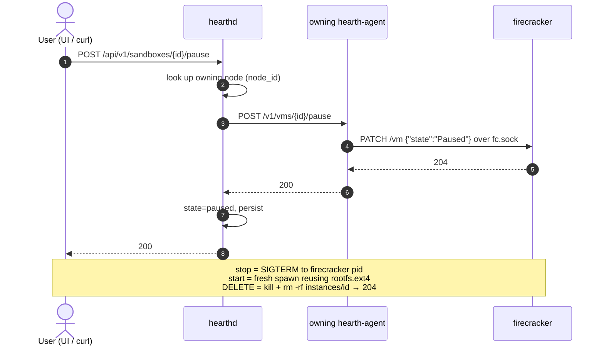
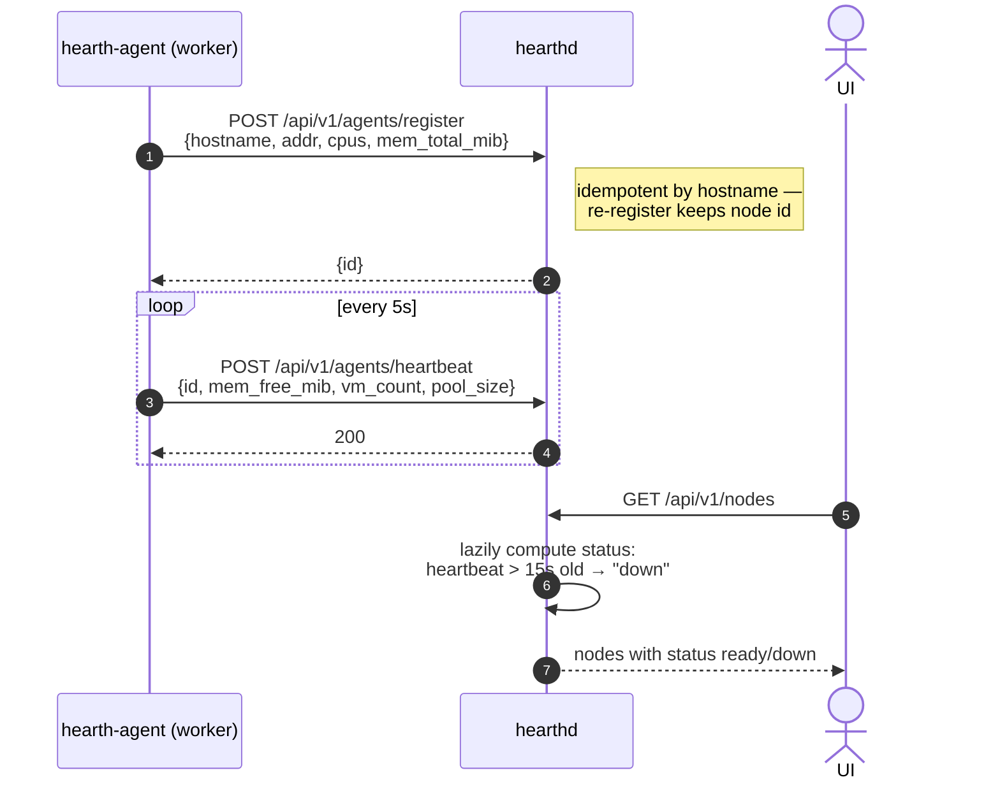
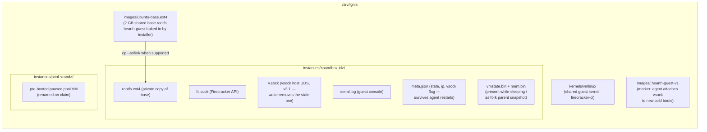

# Hearth — Architecture

Hearth is a self-hosted infrastructure SaaS that manages **Firecracker microVMs ("sandboxes") for AI workloads**.
The backend is two static binaries — `hearthd` (control plane, **Go**) and `hearth-agent` (node agent,
**Rust**) — with no Kubernetes on the control path (languages per
[ADR-0003](adr/ADR-0003-go-rust-port.md); the wire and on-disk formats are unchanged from the Zig v2
implementation and enforced by `test/conformance/`). A third component arrived with v3.1:
**`hearth-guest`** (Rust), a vsock agent baked into the guest image that gives the platform
in-guest command execution (`exec`) and fork re-IP/re-MAC — **rolled out to the lab and
verified green on 2026-06-11** (conformance 132/0, verify-v2 21/0;
[API-V3-EXEC.md](API-V3-EXEC.md) is its contract).
This document reflects **v2 + v3.1 as implemented, verified, and running** in the Lima lab: snapshot-based sleep/wake (~70 ms measured),
fork, warm pools, guest networking, bearer-token auth, and config-driven deployment — the same
static binaries (aarch64 + x86_64) run on the local lab and on remote production servers,
differing only by configuration. Remaining v3 items are listed in §9.

Related docs: [PLAN.md](PLAN.md) (adopted plan), [API-V2.md](API-V2.md) (v2 API/config contract),
[DEPLOYMENT.md](DEPLOYMENT.md) (production install + builds), [ADR-0000](adr/ADR-0000-original-hearth-plan.md)
(original baseline), [ADR-0001](adr/ADR-0001-zig-backend.md) (superseded),
[ADR-0002](adr/ADR-0002-no-kubernetes-control-plane.md), [ADR-0003](adr/ADR-0003-go-rust-port.md)
(Go+Rust port and migration record).

---

## 1. System overview



**Hot-path principle (kept from the baseline plan):** sandboxes are *not* k8s pods. The agent drives
Firecracker directly; the control plane only does placement and proxying. v2 delivers this: the warm
pool is claimed and refilled entirely on the agent, and wake is one `/snapshot/load` away — no
control-plane round trip on the latency-critical path.

**Cross-tenant isolation (v4 P1):** guest-to-guest traffic on `hearth0` is dropped unless source
and destination IPs share a tenant. One concatenated nft set (`tenant_pairs`, `ipv4_addr . ipv4_addr`,
table `ip hearth`) holds the allowed same-tenant pairs; `br_netfilter` routes bridged L2 frames
through the forward chain so same-subnet traffic can't bypass it. The agent rebuilds the set
flush-and-repopulate (idempotent, serialized) after every create/fork/delete and at startup —
`tenant_id` is only a Rust-side grouping key and never appears in an nft command. Egress NAT and
host↔guest are unaffected; tenant networks are **node-scoped** until the P2 overlay. Rationale and
alternatives: [ADR-0005](adr/ADR-0005-cross-tenant-network-isolation.md).

---

## 2. Deployment topology

The same binaries serve two topologies, differing **only by configuration**
(precedence: flags > `HEARTH_*` env > `--config` JSON > defaults — see [API-V2.md](API-V2.md) §6):



### Lima lab (development)



> **Networking gotcha:** Apple's vzNAT (`lima0`, 192.168.64.x) gives **no guest-to-guest connectivity**
> (verified: 100% loss). All inter-VM traffic uses Lima's `user-v2` network. Guests inside microVMs
> get IPs from the per-node `net_cidr` (default `10.231.0.0/24`) via the `hearth0` bridge — verified
> by host→guest ping; `--net off` restores IP-less operation.

---

## 3. Sandbox state machine



**v2 wake path (verified on the lab):** `sleep` = pause → `PUT /snapshot/create` (vmstate.bin +
mem.bin in the instance dir) → kill the Firecracker process (RAM freed). `wake` = fresh process →
`PUT /snapshot/load {resume_vm:true, network_overrides:[tap]}` → guest resumes mid-execution
(**measured wake_ms=73** on this lab). `fork` snapshots the parent (reusing snapshot files if
sleeping), copies rootfs + mem, restores the child with its own tap, sets `parent_id`; since
v3.1 the child is then re-MAC'd and re-IP'd in-guest over vsock, so it stops squatting the
parent's IP (and MAC — a memory-clone inherits both). `stopped` vs `sleeping`: cold boot
vs warm resume. Lifecycle guards (2026-06-11): `start` is a cold boot, valid only from
`stopped`/`error` — on a `paused` VM it answers 409 instead of spawning a second Firecracker
over the live instance; `pause`/`resume` are guarded the same way, and an unexpected
Firecracker exit flips the VM to `error` within seconds (exit reaper + 5s liveness sweep).

---

## 4. User flow — create a sandbox

```mermaid
sequenceDiagram
    autonumber
    actor U as User (UI / curl)
    participant H as hearthd :8080
    participant S as Scheduler
    participant A as hearth-agent :9090<br/>(chosen worker)
    participant F as firecracker<br/>(new child process)

    U->>H: POST /api/v1/sandboxes {name, namespace, vcpus, mem_mib}
    H->>S: place(sandbox)
    S->>S: filter nodes status=ready,<br/>pick lowest vm_count
    alt no ready node
        H-->>U: 503 no ready node
    end
    H->>A: POST /v1/vms {id, name, vcpus, mem_mib}
    alt warm-pool hit (1 vCPU / 256 MiB shape, pool_size > 0)
        A->>A: claim paused pool VM<br/>(rename bookkeeping, resume)
        A->>A: refill pool asynchronously
    else cold boot
        A->>A: mkdir /srv/ignis/instances/id/<br/>cp ubuntu-base.ext4 → rootfs.ext4
        A->>A: create tap hth-N on bridge hearth0,<br/>allocate next IP from net_cidr
        A->>F: spawn firecracker --api-sock fc.sock
        A->>A: poll fc.sock (≤3s)
        A->>F: PUT /boot-source (vmlinux,<br/>boot args incl. ip=10.231.0.x)
        A->>F: PUT /drives/rootfs
        A->>F: PUT /machine-config {vcpus, mem}
        A->>F: PUT /network-interfaces/eth0 {tap}
        A->>F: PUT /actions {InstanceStart}
        F-->>A: 204 — guest boots (serial.log)
    end
    A-->>H: 201 {state: running, ip: 10.231.0.x}
    H->>H: persist working set to SQLite (one tx; v4 — was state.json)
    H-->>U: 201 sandbox JSON
    Note over U,H: UI poll picks up the new<br/>sandbox within 3s
```

On error at any agent step the sandbox is marked `error` and surfaced in the UI/API.

---

## 5. User flow — lifecycle operation (pause / resume / stop / delete)



---

## 5b. User flow — sleep, wake, fork (the v2 hot path)

```mermaid
sequenceDiagram
    autonumber
    actor U as User (UI / curl)
    participant H as hearthd
    participant A as owning hearth-agent
    participant F as firecracker

    rect rgb(35,35,45)
    Note over U,F: SLEEP — free the RAM, keep the moment
    U->>H: POST /api/v1/sandboxes/{id}/sleep
    H->>A: POST /v1/vms/{id}/sleep
    A->>F: PATCH /vm {"state":"Paused"}
    A->>F: PUT /snapshot/create<br/>{vmstate.bin + mem.bin → instance dir}
    A->>A: kill firecracker, reap<br/>(RAM freed, files remain)
    A-->>H: 200 → state=sleeping, persisted
    end

    rect rgb(30,40,35)
    Note over U,F: WAKE — measured 73 ms on this lab
    U->>H: POST /api/v1/sandboxes/{id}/wake
    H->>A: POST /v1/vms/{id}/wake
    A->>F: spawn fresh firecracker
    A->>F: PUT /snapshot/load {resume_vm:true,<br/>network_overrides:[tap]}
    F-->>A: guest resumes mid-execution<br/>(no boot, no init, no warmup)
    A-->>H: 200 {state: running, wake_ms}
    H-->>U: sandbox + wake_ms (UI toast)
    end

    rect rgb(40,35,30)
    Note over U,F: FORK — one parent, N children
    U->>H: POST /api/v1/sandboxes/{id}/fork {"name"}
    H->>A: POST /v1/vms/{id}/fork
    A->>A: ensure parent snapshot<br/>(reuse if sleeping — pause→snap→resume if running)
    A->>A: reflink/copy rootfs + mem.bin to child dir,<br/>create child tap
    A->>F: spawn + /snapshot/load (child tap override)
    A-->>H: 201 child {parent_id: parent}
    end
```



Snapshot hygiene caveats: the fork child's inherited guest-internal IP **and MAC** are
**fixed in v3.1** (automatic re-MAC + re-IP via the guest agent, §5c — live in the lab);
restored guests should still re-seed entropy / fix clocks before multi-tenant production use.
**Do not sleep a guest that is still booting**: a snapshot taken ~1–2 s after boot captures a
guest that panics/reboots on resume (wall-clock jump mid-init) — the wake API reports `running`
and the Firecracker process exits seconds later (since 2026-06-11 the agent detects the exit
and flips the VM to `error` instead of leaving a stale `running`). Found during the Go/Rust
migration and present in every implementation; `verify-v2.sh` pings the guest after wake, and
both suites now wait for guest-agent readiness (`wait_guest_ready` exec poll) before sleeping.
A related v3.1 trap: sleep's SIGKILL leaves the vsock UDS file behind, and the next restore
fails with EADDRINUSE unless wake removes the stale `v.sock` first (it does).

---

## 5c. User flow — exec and fork re-IP (v3.1, via the guest agent)

Both v3.1 features ride the same channel: a Firecracker **vsock** device (host side: `v.sock`
in the instance dir) connected to **hearth-guest**, a small Rust server baked into the base
image and started by systemd inside every guest. The device is attached at cold boot only when
the image carries the `.hearth-guest-v1` marker, so un-injected images keep exact v2 behavior.

```mermaid
sequenceDiagram
    autonumber
    actor U as User (UI / curl)
    participant H as hearthd
    participant A as owning hearth-agent
    participant F as firecracker vsock (v.sock)
    participant G as hearth-guest (in guest, port 52)

    rect rgb(30,38,46)
    Note over U,G: EXEC — run a command inside the sandbox
    U->>H: POST /api/v1/sandboxes/{id}/exec {cmd, timeout_ms}
    H->>A: POST /v1/vms/{id}/exec (per-request timeout)
    A->>F: connect v.sock, CONNECT 52
    F-->>A: OK (guest accepted)
    A->>G: {"op":"exec","cmd":[...],"timeout_ms":N}
    G->>G: spawn cmd, capture stdout/stderr,<br/>SIGKILL on timeout (exit 124)
    G-->>A: {"ok":true,"exit_code":0,"stdout":...,"stderr":...}
    A-->>H: 200 (guest JSON verbatim)
    H-->>U: 200 {exit_code, stdout, stderr}
    Note over H,A: pre-v3.1 VM or no marker → 501 guest agent unavailable
    end

    rect rgb(40,35,30)
    Note over U,G: FORK RE-IP — child stops squatting the parent's IP
    U->>H: POST /api/v1/sandboxes/{id}/fork {"name"}
    H->>A: POST /v1/vms/{id}/fork
    A->>A: restore child from parent snapshot<br/>(own tap + own v.sock via vsock override)
    A->>G: {"op":"exec","cmd":["ip","link","set","dev","eth0","address",child_mac]}<br/>(fresh locally-administered MAC — the memory-clone shares the parent's)
    A->>G: {"op":"set_ip","ip":child_ip,"prefix":24,"gw":...}<br/>(up to 3 attempts, best-effort)
    G->>G: ip addr flush + add, route replace default
    G-->>A: {"ok":true}
    A-->>H: 201 child {parent_id, ip: child_ip}
    Note over A,G: child now answers on ITS ip/MAC — parent keeps its connectivity
    end
```



---

## 6. Node lifecycle — registration, heartbeat, failure detection



The scheduler reads `vm_count` from heartbeats, so placement freshness is bounded by the 5s
heartbeat interval (known wart: rapid back-to-back creates can land on one node). Registration
and heartbeats carry the bearer token when auth is enabled. Sleeping VMs survive agent restarts:
the agent reconciles instance dirs and `meta.json` on startup.

---

## 7. User flow — UI data loop (live vs mock, flicker-free updates)


This split is what fixed the visible flicker: heartbeats mutate every poll, so only genuinely
structural changes rebuild the DOM; volatile values are patched into existing elements.

---

## 8. Storage layout (per worker)



v3 replaces the full rootfs copy with **overlayfs**: shared read-only base + tiny per-VM upper layer
(the E2B/Modal image-dedup pattern), which also makes disk fork O(1) — today fork copies
`rootfs.ext4` and `mem.bin` (simple and safe; shared read-only memory mapping is the v3 optimization).

---

## 9. Status — shipped (v2), live (v3.1), and what remains

Shipped in v2, then ported to Go (`hearthd`) and Rust (`hearth-agent`) under the frozen
API-V2 contract — all verified end-to-end on the lab (17/17 system checks +
`test/conformance/` contract suite, goldens recorded from the Zig reference;
migration record in [ADR-0003](adr/ADR-0003-go-rust-port.md)):

| Capability | v2 implementation |
|---|---|
| `sleep` / `wake` | snapshot/create → kill; snapshot/load resume — **wake_ms≈70 measured** (67–85 across both implementations) |
| `fork` | parent snapshot + rootfs/mem copy + own tap via `network_overrides`, `parent_id` set |
| Warm pool | `pool_size` paused VMs per agent; matching create claims one, async refill |
| Guest networking | bridge `hearth0` + per-VM tap + sequential IP (`net_cidr`) + nftables masquerade; `ip` populated; host→guest ping verified |
| Auth | optional bearer token (`HEARTH_TOKEN`/config/flag); 401 without; constant-time compare; UI `?token=` support |
| Production config | flags > env (`HEARTH_*`) > `--config` JSON > defaults; no hardcoded paths; static binaries for **aarch64 + x86_64**; systemd units + installer in `deploy/`, guide in `DEPLOYMENT.md` |

v3.1 — **live in the lab** (rolled out and verified 2026-06-11: conformance **132/0** + verify-v2
**21/0**; contract: [API-V3-EXEC.md](API-V3-EXEC.md)):

| Capability | v3.1 implementation | Validation |
|---|---|---|
| `exec` (run commands in guests) | `POST .../exec` → agent → FC hybrid vsock (`CONNECT 52`) → `hearth-guest` in the image (systemd unit); 501 for pre-v3.1 VMs | exit code + output round-trip on cold-booted and woken guests; wake still ~69 ms with vsock attached |
| Fork guest re-IP + re-MAC | agent first sets a fresh locally-administered MAC on the child (plain `exec` — the memory-clone shares the parent's MAC), then `set_ip` over vsock (best-effort, 3 attempts) | fork child answers on its own IP **and the parent keeps its connectivity** (shared-MAC bridge-FDB flap found and fixed in lab verification) |
| Asset pipeline | `infra/guest-agent-install.sh` injects binary+unit into the base image and drops the `.hearth-guest-v1` marker that gates the vsock device | idempotent run against an image copy; un-injected images keep exact v2 behavior |
| Lifecycle hardening | `start` = guarded cold boot (`stopped`/`error` only; 409 `InvalidState` otherwise — start-on-paused used to orphan the live FC); `pause`/`resume` guarded; FC exits detected (spawn reaper + 5 s sweep) → `state:error`; failed spawns reaped; dead pool VM falls through to cold boot | start-on-paused 409 regression cases in conformance (agent/07, hearthd/10); poisoned wake flips to `error` within ~5 s instead of a stale `running` |

v4 — multi-tenant, deploy-anywhere, product-ready (in progress; plan P0–P6,
[ADR-0004](adr/ADR-0004-tenancy-and-sqlite.md)):

| Phase | Capability | Status |
|---|---|---|
| P0 | Tenancy (API keys, enforced namespaces, quotas, usage metering) + SQLite store (`go/internal/store`, pure-Go driver, one-time state.json import) | **live in the lab 2026-06-12** — conformance **166/0** (new `hearthd/17-tenancy`), verify-v2 **21/0**; contract in API-V2 §3b |
| P1 | Cross-tenant network isolation (br_netfilter + single concatenated nft pair set `tenant_pairs`, flush-and-rebuild from full membership; `tenant_id` never hits an nft command) | **live in the lab 2026-06-12** — conformance **178/0** (new `agent/11-isolation`), verify-v2 **21/0**; design in [ADR-0005](adr/ADR-0005-cross-tenant-network-isolation.md); tenant networks node-scoped until P2 |
| P2 | WireGuard hub-and-spoke overlay (hearthd = hub; one-time join tokens, sha256-at-rest, consume-last; agent `--join` + persisted `wg.json`), in-binary TLS (autocert), fleet under hardened systemd units | **overlay live in the lab 2026-06-12** — mixed fleet (one direct + one overlay worker), conformance **193/0** (new `hearthd/18-join`), verify-v2 **21/0**; design in [ADR-0006](adr/ADR-0006-wireguard-overlay-and-node-join.md); contract in API-V2 §3c; 48h systemd soak running; mixed-fleet acceptance (P2.6: external worker + live TLS) pending external infra |
| P3 | Multi-service ingress: named exposes (route row + worker nft DNAT, node ports 20000-29999), `hearth-gw` reverse proxy (Host `name--id` routing, WebSocket passthrough, 503 wake page, dynamic port-in-hostname opt-in, per-tenant edge limits) | **live in the lab 2026-06-12** — conformance **227/0** (new `hearthd/19-expose`, +34 checks), verify-v2 **21/0**; live e2e: HTTP + WebSocket 101 through gw→DNAT→guest on the direct worker, dynamic route over the wg overlay worker, sleep→wake page→recovery, fork child URLs serving; design in [ADR-0007](adr/ADR-0007-sandbox-ingress.md); contract in API-V2 §3d; wildcard TLS + auto-wake deferred (external infra / P5) |
| P4 | Templates (docker-base, odoo) + bigger guests + per-template pools | planned |
| P5 | Streaming exec, idle/TTL policies, TS SDK, usage aggregation | planned |
| P6 | Observability, bench, HA groundwork | planned |

Remaining beyond v4:

| Capability | Mechanism |
|---|---|
| `branch` (fork a *running* VM without pausing perception) | diff snapshots + uffd shared-memory CoW (fork currently copies mem.bin) |
| Root-disk dedup | overlayfs shared RO base (today: full rootfs copy per VM) |
| Postgres / HA state | behind the `Store` interface (SQLite done in v4 P0) |
| Reschedule across nodes | snapshot → ship → restore (needs node-decoupled storage) |
| OIDC / multi-user auth | token-exchange resolving to the same tenant entities as API keys |
| Pool-orphan reclaim | a paused pool FC orphaned by an agent restart is reconciled to `stopped` but its process is not reaped (1:1 with v2 behavior) |
| uffd lazy restore / CoW fork | in-process userfaultfd in the Rust agent (the reason the agent is Rust — rust-vmm territory) |
| Terraform provider | Go provider against the hearthd API (the reason the control plane is Go) |
